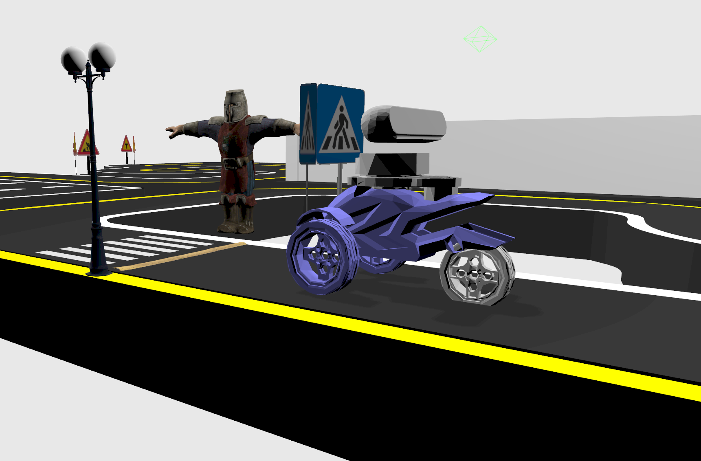

# AutoRace 2023
A ROS2 metapackages for AutoRace 2023 challenge.

<div align="center">
  
</div>

## Included packages

* `robot_description` - holds the SDF description of the simulated robot, including sensors.

* `referee_console` - holds a referee node that is required for participants to run.

* `robot_bringup` - holds launch files, worlds and multiple configurations that serve as an example and as a required system for AutoRace to work.

* `my_robot_controller` - our custom package wich holds node for controle robot.

## Usage for AutoRace 2023

1. Install dependencies

	```bash
	cd ~/ros2_ws
	rm -rf build/ install/ log/
	colcon build
	source install/setup.bash

	sudo apt update
	sudo apt upgrade -y

	sudo apt install curl -y
	sudo curl -sSL https://raw.githubusercontent.com/ros/rosdistro/master/ros.asc | sudo apt-key add -
	sudo sh -c 'echo "deb http://packages.ros.org/ros2/ubuntu $(lsb_release -cs) main" > /etc/apt/sources.list.d/ros2-latest.list'
	sudo apt update

	rosdep update
	rosdep install --from-paths src --ignore-src -r -i -y --rosdistro humble

	sudo apt install python3-ament-tools
	sudo apt install ros-humble-geographic-msgs ros-humble-robot-localization

	pip install keyboard

	rm -rf build/ install/ log/
	colcon build
	source install/setup.bash
	```

4. Launch the simulation

    ```bash
    ros2 launch robot_bringup autorace_2023.launch.py
    ```

5. Run control package

    ```bash
    	ros2 run my_robot_controller run
    ```

6. Run the referee

    ```bash
    ros2 run referee_console mission_autorace_2023_referee
    ```
